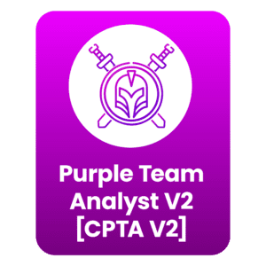

# 🏳️ whoami
- Red Team Lead  
- Synack Red Team Researcher

 

# 🏳️ Certification
## Red Team Operations Track
### Against On-prem Environments
  

### Against Web Applications

### Against Cloud Environments
 

## Purple Team Operations Track

## Blue Team Operations Track
  

### Threat Intelligence and Modeling
  

## System & Architecture
 

## Expired  
  

 

# 📖 Reading Log
Tracking what I've read and where I left off.

## Threat Hunting

| Packet | Packet |
|------|------|
| 
 <a href="./reading_log/The_Fundations_of_Threat_Hunting.md">Reading_log</a>
 | 
 <a href="./reading_log/Practical_Threat_Intelligence_and_Data-Driven_Threat_Hunting.md">Reading_log</a>
 |

