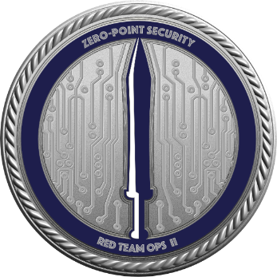
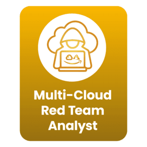
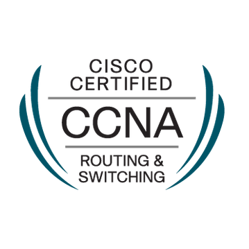

# 🏳️ whoami
- Red Team Lead  
- Synack Red Team Researcher

 

# 🏳️ Certification
## Red Team Operations Track
### Against On-prem Environments
  

### Against Cloud Environments
 

## Purple Team Operations Track

## Blue Team Operations Track
 

### Threat Intelligence and Modeling
  

## System & Architecture
 

## Expired  
  

